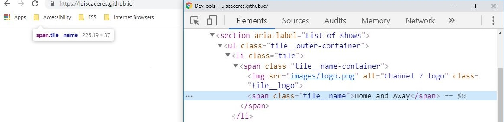
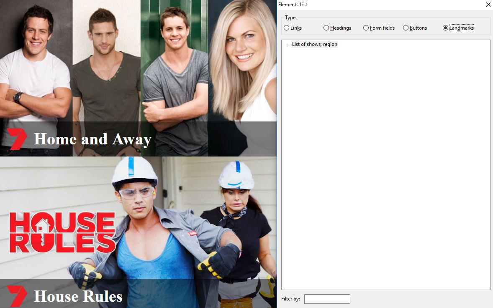
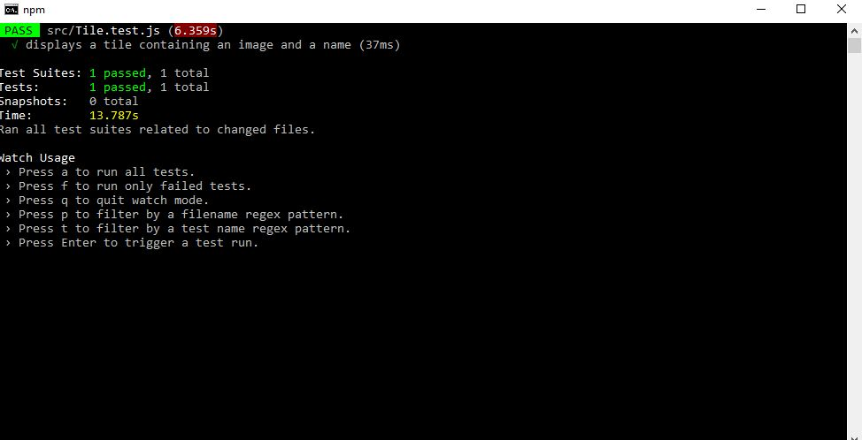

# Overview

I created a `Tile` reusable and responsive component in React. A tile consists of a name and an accompanying image.


**Figure 1: A tile.**

The `Tile` component is styled through plain vanilla CSS instead of styled components. I have never worked with style components before. For that reason, I'd like to have the opportunity to get hands-on experience with it. 

**Usage:**

```
<Tile name={string} src={url}>
```

where `string` is any arbitrary string and `url` is the file path of an image file.

## Example:

**Input:**
```
<Tile name="Home and Away" src="images/tile-1.jpg">
```

**Output:**
```
<li class="tile">
    <span class="tile__name-container">
        
        <span class="tile__name">Home and Away</span>
    </span>
    
</li>
```

Below there's a more in depth explanation about different aspects of this project.

</br>
</br>

# About HTML

I structure the HTML semantically. Please refer to the Accessbility section for more information.

I recommend the use of the `<picture>` element to reduce the time required to load the images in the `Tile` component. Users on mobile devices will benefit mostly. In this case, a visual designer needs to provide the same image at different resolutions.

</br>
</br>

# About CSS

I leverage the Flexible Box Layout (Flexbox) to achieve responsiveness without the use of any media queries at all. This result is less code. I created the styles for the `Tile` component in such a way that there can be any arbitrary number of tiles. This doesn't sacrifice responsiveness.


**Figure 2: Different number of tiles shown on a 1920 pixel wide viewport.**

</br>

It's possible to position of the name of a tile through absolutely positioning. However, I've identified an issue with this. If for whatever reason the image fails to load, the name of a tile will be off the screen and innaccesible for reading. This will also happen if the user disables images to save on bandwidth. To solve this issue I use grid layout. Browsers not supporting the grid layout will degrade gracefully. Please refer to the images below.



**Figure 3: The name of a tile (absolutely positioned) is off the screen when the image fails to load.**


**Figure 4: The name of a tile will visible even if the image fails to load.**


**Figure 5: Graceful degradation on Internet Explorer. The name of a tile is entirely below the image instead of being overlayed.**

</br>

I use `position: sticky` to make sure that the name of a tile remains visible as long as the tile itself is on the screen. This eliminates the need to manipulate 'stickyness' through JavaScript which can cause performance issues during scrolling. Please note `position: sticky` is not supported on Internet Explorer.


**Figure 6: The name of a tile remains visible as long as the tile itself is visible as well.**

</br>
</br>
</br>

# About Accessibility

Please note the use of the `<section>` element as a navigational landmark. Users of assistive technologies such as screen readers benefit from well structured markup. It allows them to navigate to a specific landmark without having to go through any other landmarks within the markup.



**Figure 7: Elements list (navigational landmarks) panel on NVDA screen reader.**

</br>

I recommend decreasing the opacity level that contains the tile name. This is in order to make text more legible. In some cases, the text and the background image may have a similar colour which makes the text harder to read.


**Figure 8: Different levels of opacity applied to the box that contains the tile name.**

</br>
</br>

# About Testing

I use Jest as a test runner from the command line.



**Figure 9: Testing with Jest on the command line.**.
